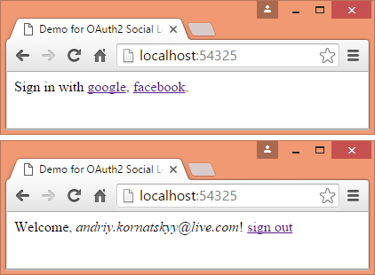

# OAuth2 Social Authentication

A simple web API written using [ASP.NET Web API](http://www.asp.net/web-api)
and [Microsoft OWIN](http://katanaproject.codeplex.com/)
for [OAuth2](http://oauth.net/2/) social authentication with Google or Facebook.

	

## Prepare

In *web.config* change app settings for:

- *Google.ClientId* and *Google.ClientSecret*.
- *Facebook.AppId* and *Facebook.AppSecret*.
	
OAuth2 redirect callbacks:

- http://localhost:54325/oauth2/google/callback
- http://localhost:54325/oauth2/facebook/callback

[CORS](https://en.wikipedia.org/wiki/Cross-origin_resource_sharing):
update *urls* in *index.html*. See more about using custom domains 
with IIS Express 
[here](http://stackoverflow.com/questions/4709014/using-custom-domains-with-iis-express).

## Useful Links

- [Facebook](https://developers.facebook.com/apps/) for Developers
- [Google](https://console.developers.google.com) Developers Console